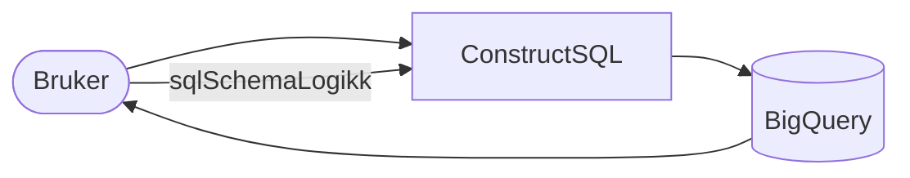

# Innleveringsfrist versjon
## EndringerTilNavIkt

# Jamph-Rag-Api-Umami

Kotlin RAG API that connects Umami Analytics with an Ollama LLM for natural language queries and SQL generation.

## Requirements

- Java 21 LTS (Java 21+)
- Maven 3.9+
- Ollama (optional — only needed for `/api/chat` and `/api/sql`)

### Mac/Linux Setup

If Maven or Java 21 are not installed, install them via Homebrew:

```bash
brew install maven openjdk@21
```

Then add Java 21 to your PATH in `~/.zshrc`:

```bash
export PATH="/usr/local/opt/openjdk@21/bin:$PATH"
export JAVA_HOME="/usr/local/opt/openjdk@21/libexec/openjdk.jdk/Contents/Home"
```

Apply the changes:

```bash
source ~/.zshrc
```

## Start the API

**Windows:**
```powershell
.\start-api.ps1
```

**Mac/Linux:**
```bash
mvn clean package -Dmaven.test.skip=true
java -jar target/api-1.0-SNAPSHOT-jar-with-dependencies.jar
```

The API will start on `http://localhost:8004`.

## Verify

```bash
curl http://localhost:8004/health
```

## Endpoints

| Method | Path | Description |
|--------|------|-------------|
| GET | `/health` | Health check |
| POST | `/api/chat` | Natural language query via Ollama |
| POST | `/api/sql` | Generate SQL from natural language |

**Chat example:**
```bash
curl -X POST http://localhost:8004/api/chat \
  -H "Content-Type: application/json" \
  -d '{"message": "What is Umami Analytics?"}'
```

**SQL example:**
```bash
curl -X POST http://localhost:8004/api/sql \
  -H "Content-Type: application/json" \
  -d '{"query": "Show total pageviews for all websites"}'
```

## Configuration

Edit `src/main/resources/application.conf` or use environment variables:

| Variable | Default | Description |
|----------|---------|-------------|
| `API_PORT` | `8004` | API port |
| `OLLAMA_BASE_URL` | `http://localhost:11434` | Ollama URL |
| `OLLAMA_MODEL` | `qwen2.5-coder:7b` | Model to use |

## Ollama (optional)

Only needed if you want LLM features. Start it separately in any order — the API will work without it.

```bash
ollama serve
ollama pull qwen2.5-coder:7b
```

## Docker

```bash
docker compose -f docker-compose.dev.yml up
```

---

## Henvendelser

Enten:
Spørsmål knyttet til koden eller repositoryet kan stilles som issues her på GitHub

Eller:
Spørsmål knyttet til koden eller repositoryet kan stilles til teamalias@nav.no (som evt må opprettes av noen™ Windows-mennesker) eller som issues her på GitHub (stryk det som ikke passer).

### For Nav-ansatte

Interne henvendelser kan sendes via Slack i kanalen #teamkanal.(teamreasarchobs)


Modeller:

    # echo "Pulling qwen2.5-coder:7b..." && \
    # timeout 900 ollama pull qwen2.5-coder:7b && \
    # echo "Pulling DeepSeek-R1-Distill-Qwen-7B..." && \
    # timeout 900 ollama pull deepseek-r1:7b && \
    # echo "Pulling Mistral 7B..." && \
    # timeout 900 ollama pull 7Bmistral:7b && \
    # echo "Pulling Qwen2.5-Coder-7B..." && \
    # timeout 900 ollama pull qwen2.5-coder:7b && \
    # echo "Qwen3.5 7B..." && \
    # timeout 900 ollama pull qwen3.5:9b && \
    # echo "Phi-4-mini..." && \
    # timeout 900 ollama pull phi4-mini && \
    echo "DeepSeek-Coder-V2-Lite..." && \
    timeout 900 ollama pull deepseek-coder-v2:16b && \


    #redeploy x7

    # Enkel SQL Flyt

RAG versjon 1. Dette diagrammet viser en enkel flyt fra bruker til SQL-generering og tilbake. 


RAG versjon 2. Dette diagrammet viser en veldig dtaljert flyt fra bruker til SQL-generering og tilbake ned til kallnivå.

```mermaid
sequenceDiagram
    participant FE as Frontend<br/>(Node.js/React)
    participant API as Jamph-Rag-Api-Umami<br/>(Ktor/Kotlin)
    participant BQ as BigQuery<br/>(fagtorsdag-prod)
    participant LLM as Ollama<br/>(qwen2.5-coder:7b)

    Note over FE,LLM: User asks SQL question from Frontend (RagV2 Pipeline)

    FE->>API: POST /api/sql<br/>{query: "Topp 10 sider siste måned", url: "https://aksel.nav.no",<br/>pathOperator: "starts-with"}

    API->>API: Application.kt receives request<br/>RagV2SqlService.generateSql()

    Note over API: Step ① — Classify query type
    API->>BQ: bigQueryService.getWebsites()
    BQ-->>API: [{id: "fb69...", name: "Aksel", domain: "aksel.nav.no"}]
    API->>API: urlToSiteIdAndPath(url, websites)<br/>→ siteId: "fb69...", urlPath: ""

    API->>LLM: POST /api/generate (generateConstrained)<br/>{model: "qwen2.5-coder:7b", prompt: "Classify: 'Topp 10 sider...'<br/>→ linear/rankings/search/journey/cards/default", temperature: 0.0}
    LLM-->>API: response: {"queryType": "rankings"}

    Note over API: Step ② — Extract variables from question
    API->>API: PrebuiltSchemaService.getBigQuerySchema("rankings")<br/>PrebuiltSchemaService.getJsonSchema("rankings")<br/>PrebuiltSchemaService.getSimplifiedSql("rankings")

    API->>LLM: POST /api/generate<br/>{prompt: "Extract variables from 'Topp 10 sider...' Schema: [rankings BQ schema]<br/>Fill JSON: {LIMIT, ORDER_BY, START_DATE, END_DATE...}"}
    LLM-->>API: response: {"LIMIT": "10", "ORDER_BY": "DESC",<br/>"START_DATE": "2026-04-07", "END_DATE": "2026-05-07", "METRIC_SQL": "COUNT(*)"}

    Note over API: Step ③ — Construct SQL from template
    API->>API: ConstructSQL.constructSql("rankings", variables, siteId, urlPath)<br/>PrebuiltSchemas.getSqlTemplate("rankings")<br/>→ Replace [LIMIT], [ORDER_BY], [START_DATE], [WEBSITE_ID], [PATH] with extracted values<br/>→ Strip unfilled [WHERE_FILTERS], fix backticks

    API-->>FE: {sql: "SELECT url_path, COUNT(*) AS visits<br/>FROM `fagtorsdag-prod-81a6.umami_student.event`<br/>WHERE website_id = 'fb69...' AND created_at >= '2026-04-07'<br/>GROUP BY url_path ORDER BY visits DESC LIMIT 10"}

    Note over FE,BQ: User executes the generated SQL

    FE->>FE: executeBigQueryQuery(sql)<br/>bigQueryApi.ts → POST /api/bigquery
    FE->>BQ: @google-cloud/bigquery SDK<br/>runQuery(sql)
    BQ-->>FE: [{url_path: "/komponenter", visits: 4821}, ...]

    FE->>FE: Render results as bar chart / table widget